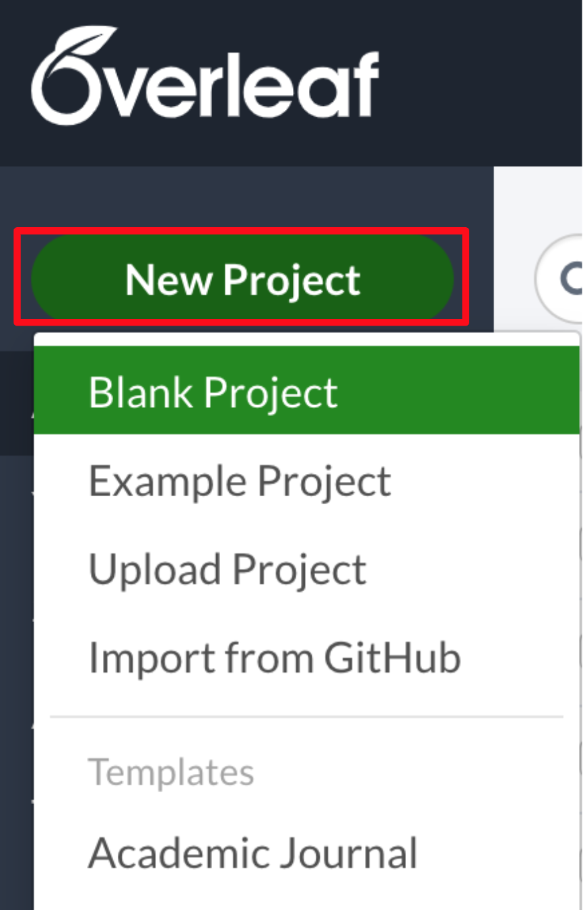
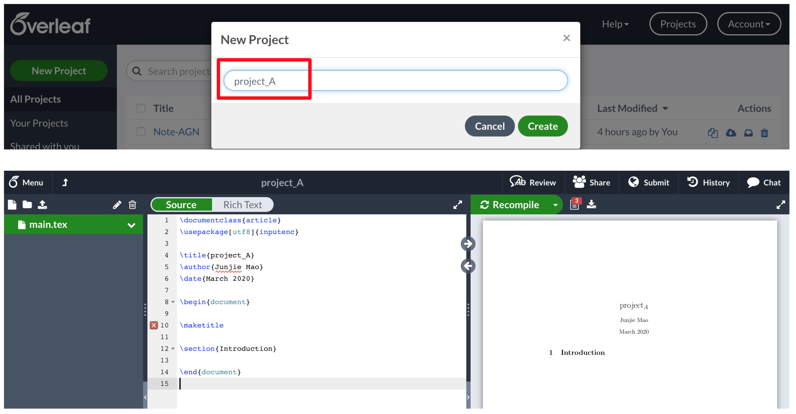
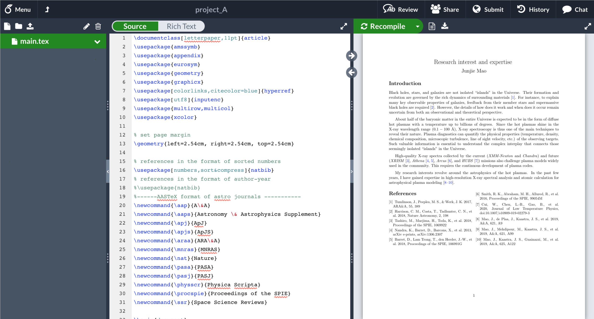
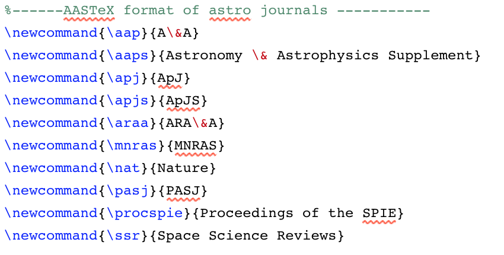
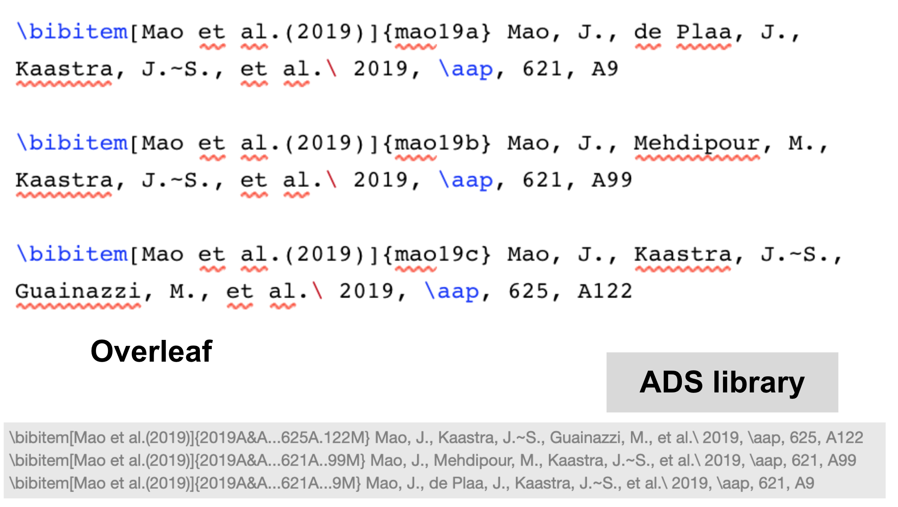

.. _sec:overleaf:

Overleaf bibliography
=====================

.. highlight:: none

Goal
----

Take advantage of the ADS personal library to create bibliography items on
`Overleaf <https://www.overleaf.com>`_.

Preparation
-----------

Create an Overleaf account and sign in with your account.

Create a project
----------------
Here we create a new/blank project named project_A.

Now, you should have a main tex file with some lines filled automatically in
this project_A.

Replace the content of the tex file
----------------------------------
Next, we replace the content of the tex file with the example (:download:`download <main.tex>`).

.. note:: In this example, the references are in the format of sorted numbers,
   while the format of author-year is more common for A&A, ApJ, MNRAS.

To use the exported bibitems from the ADS library, we need to define
the journals first.

.. note:: A set of shorter labels (mao19a, mao19b, and mao19c) are used for the
   exported bibitems from the ADS library.

Final remarks
-------------

This is the end of this thread.

.. note:: A general documentation of the bibliography management in LaTeX
   can be found `here <https://www.overleaf.com/learn/latex/Bibliography_management_in_LaTeX>`_.
